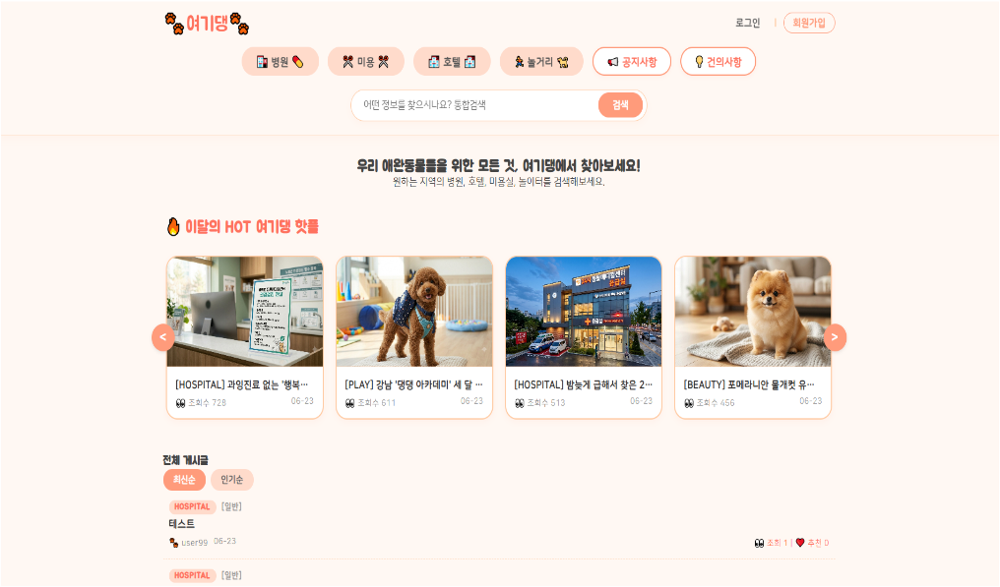
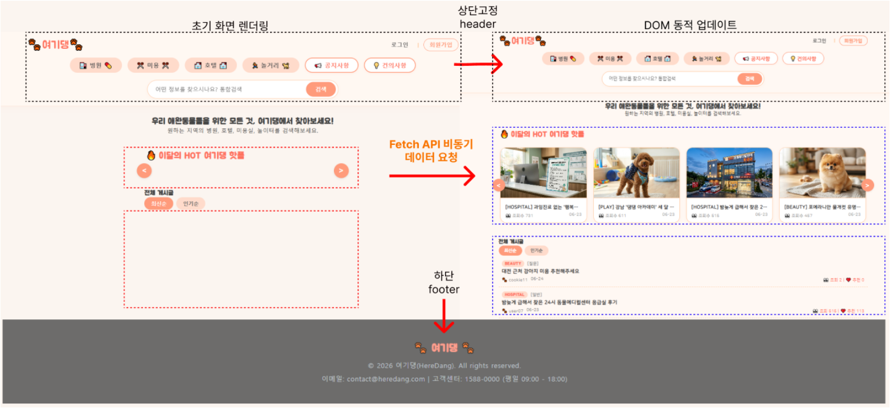

# 여기댕 – 우리 동네 댕댕이 커뮤니티

반려동물 보호자를 위한 동네 커뮤니티 웹 서비스입니다.
병원 · 미용 · 호텔 · 놀거리 4개 게시판과 공지사항, 건의사항이 있고,
신고가 쌓인 글은 가려지고 가려진 글이 많은 회원은 정지되는 규칙이 있습니다.

| 항목 | 내용 |
|---|---|
| 기간 | 2026.06.16 ~ 2026.06.24 (약 2주), 발표 2026.06.26 |
| 인원 | 4명 – 이광일(팀장, 관리자 · 댓글), 김병래(게시판), 이현진(회원), 이용우(메인 페이지 · 디자인) |
| 구조 | JSP가 DAO를 직접 부르는 Model 1 구조 |
| 규모 | JSP 63개, Java 클래스 10개 |

## 화면

**메인 화면** – 조회수 상위 8개 글을 넘겨 보는 인기글 영역과 전체 게시글 목록



**메인 페이지 동작 흐름** – 머리말 · 꼬리말을 먼저 그리고, Fetch API로 받은 JSON으로 인기글과 목록을 채웁니다.



## 내가 맡은 부분 (이용우)

메인 페이지와 서비스 전체의 화면 디자인(색상 · 레이아웃)을 맡았습니다.

| 파일 | 하는 일 |
|---|---|
| `views/main/mainPage.jsp` | 메인 화면의 틀 (인기글 영역, 게시글 목록 영역) |
| `views/js/main.js` | 게시판 · 정렬 · 검색 · 페이지 조건으로 서버에 요청하고, 받은 JSON으로 목록 · 페이지 번호 · 인기글을 그림 |
| `views/main/getPostDataJson.jsp` | 게시글 목록과 전체 페이지 수를 JSON으로 돌려줌 |

메인 목록은 아래 순서로 바뀝니다. 페이지 전체를 다시 불러오지 않아서 화면이 깜빡이지 않습니다.

```
게시판 · 정렬 · 검색 · 페이지 번호를 고름
  → main.js가 조건을 주소에 붙여 getPostDataJson.jsp로 요청 (fetch)
  → getPostDataJson.jsp가 BoardDAO로 DB를 조회해 JSON으로 응답
  → main.js가 받은 JSON으로 목록과 페이지 번호만 다시 그림
```

## 팀이 함께 만든 기능

| 영역 | 기능 |
|---|---|
| 회원 | 회원가입(정규식 입력 검사, fetch로 아이디 중복 확인), 세션 로그인, 아이디 · 비밀번호 기억(쿠키 7일), 아이디 · 비밀번호 찾기, 정보 수정, 탈퇴(행을 지우지 않고 상태값만 바꿈) |
| 게시판 | 글 작성 · 수정 · 삭제, 이미지 첨부(10MB 제한, 같은 이름이 있으면 자동으로 이름을 바꿔 저장), 검색(제목 · 내용 · 작성자), 정렬(최신 · 조회 · 추천), 카테고리, 10개씩 페이지 나누기 |
| 중복 방지 | 로그인한 사용자가 같은 글에 조회 · 추천 · 비추천 · 신고를 한 번만 반영. 행동을 이력 테이블(`board_history`)에 남기고, 이력 저장과 숫자 증가를 하나의 트랜잭션으로 묶음 |
| 댓글 | 댓글과 답글. 묶음 번호(`reply_group`), 깊이(`depth`), 부모 댓글 번호(`parent_reply_id`)로 계층을 표현 |
| 관리자 | 회원 권한 · 상태 변경, 공지사항(상단 고정), 건의사항 답변과 미답변 건수, 신고 · 블라인드 글 관리 |
| 자율 정화 | 신고가 5번 쌓이면 글 내용이 자동으로 가려짐. 관리자가 블라인드 처리한 글이 5개가 되면 작성자가 자동으로 정지됨 |

## 기술 스택

| 구분 | 사용 기술 |
|---|---|
| Language | Java 21 |
| Backend | JSP (Model 1), JDBC, DAO · DTO 패턴 |
| Database | Oracle |
| Frontend | HTML5, CSS3, JavaScript (Fetch API) |
| Library | ojdbc17 (Oracle JDBC 드라이버), cos.jar (파일 업로드) |
| Server / Tool | Apache Tomcat 9.0, Eclipse, SQL Developer, Git |

## 프로젝트 구조

```
mini
├── docs/images                  # README 화면 캡처
├── src/main/java
│   ├── db.properties            # DB 접속 정보 (GitHub에 올리지 않음)
│   ├── db.properties.example    # 접속 정보 양식
│   └── web/bean
│       ├── admin                # DBConnection, AdminDAO
│       ├── board                # BoardDAO, BoardDTO, ReplyDAO, ReplyDTO, QnaReplyDTO
│       └── member               # MemberDAO, MemberDTO, MyBoardDAO
└── src/main/webapp
    ├── WEB-INF                  # web.xml, lib (jar 파일은 GitHub에 올리지 않음)
    └── views
        ├── admin                # 관리자 페이지
        ├── board                # 게시판
        ├── components           # 공통 머리말 · 꼬리말
        ├── css, js              # 디자인, 메인 페이지 스크립트
        ├── main                 # 메인 페이지, JSON 응답
        ├── member               # 회원 기능
        └── upload               # 업로드한 이미지 (GitHub에 올리지 않음)
```

## 실행 방법

1. **라이브러리 준비** – 라이선스와 용량 문제로 jar 파일은 저장소에 없습니다. 아래 두 파일을 `src/main/webapp/WEB-INF/lib` 에 넣어 주세요.

   | 파일 | 용도 | 다운로드 |
   |---|---|---|
   | `ojdbc17.jar` | Oracle JDBC 드라이버 | [Oracle JDBC 다운로드](https://www.oracle.com/database/technologies/appdev/jdbc-downloads.html) |
   | `cos.jar` | 파일 업로드 (MultipartRequest) | [O'Reilly COS](http://www.servlets.com/cos/) |

2. **DB 접속 정보 설정** – `src/main/java/db.properties.example` 을 같은 위치에 `db.properties` 로 복사하고 값을 채웁니다. `db.properties` 는 `.gitignore` 에 등록되어 있어 GitHub에 올라가지 않습니다.

   ```properties
   db.driver=oracle.jdbc.driver.OracleDriver
   db.url=jdbc:oracle:thin:@localhost:1521:orcl
   db.user=계정명
   db.password=비밀번호
   ```

3. **테이블 생성** – Oracle 계정에 아래 테이블과 시퀀스가 필요합니다. `member` 테이블 생성문은 `MemberDTO.java` 위쪽 주석에 있습니다.

   | 테이블 | 용도 | 주요 컬럼 |
   |---|---|---|
   | `member` | 회원 | `id`, `pw`, `name`, `birth`, `phone`, `gender`, `email`, `reg`, `status`, `role` |
   | `board` | 게시글 · 공지 · 건의사항 | `post_id`, `board_type`, `category`, `title`, `content`, `writer`, `reg_date`, `view_count`, `like_count`, `dislike_count`, `report_count`, `is_blind`, `file_name` 등 |
   | `board_reply` | 댓글 · 답글 | `reply_id`, `post_id`, `content`, `writer`, `reg_date`, `parent_reply_id`, `depth`, `reply_group` |
   | `board_history` | 조회 · 추천 · 신고 이력 | `post_id`, `user_id`, `action_type`, `reg_date` |
   | `board_seq` | 게시글 번호 시퀀스 | - |

4. **서버 실행** – Eclipse에서 Apache Tomcat 9.0에 프로젝트를 추가하고 실행한 뒤 접속합니다.

   ```
   http://localhost:8080/mini/views/main/mainPage.jsp
   ```

   컨텍스트 경로는 `/mini` 기준입니다. 다르게 배포하면 `src/main/webapp/views/js/main.js` 의 `ctx` 값도 함께 바꿔야 합니다.

## 프로젝트가 끝난 뒤 정리한 것

| 날짜 | 내용 |
|---|---|
| 2026.08.31 | DB 접속 정보를 코드에서 빼서 `db.properties` 로 분리하고, 이 파일은 GitHub에 올라가지 않게 함 |
| 2026.08.31 | 회원 상태값(정상 `1` / 탈퇴 `0` / 정지 `-1`) 설명이 파일마다 달랐던 것을 한 가지로 맞춤 |
| 2026.08.31 | DAO가 DB 연결 객체를 필드로 들고 있어서 동시에 요청이 오면 서로 덮어쓸 수 있던 구조를, 메서드 안에서 만들고 try-with-resources로 닫게 바꿈 (`MemberDAO`, `MyBoardDAO`) |
| 2026.10.01 | 메인 페이지에서 2쪽을 누르면 11번째가 아니라 2번째 글부터 나오던 페이징 오류 수정 (`getPostDataJson.jsp`) |

## 알고 있는 한계와 고칠 방법

| 한계 | 고칠 방법 |
|---|---|
| 비밀번호를 암호화하지 않고 저장 · 비교함 | BCrypt 같은 단방향 암호화로 저장 |
| '아이디 · 비밀번호 기억' 쿠키에 비밀번호가 그대로 들어감 | 비밀번호 대신 서버가 발급한 임의의 토큰을 저장 |
| 로그인하지 않은 사용자는 새로고침할 때마다 조회수가 오름 | 세션이나 쿠키로 같은 글은 한 번만 세기 |
| 답글의 답글(깊이 2 이상)은 부모 바로 아래가 아니라 같은 묶음의 끝에 표시됨 | Oracle 계층 쿼리(`CONNECT BY`)나 경로 값으로 정렬 |
| 메인 목록을 그릴 때 제목 등을 `innerHTML` 로 그대로 넣음 (`main.js`) | 특수문자를 변환한 뒤 넣어 스크립트 실행(XSS) 막기 |
| 검색어를 주소에 붙일 때 인코딩하지 않아 `&`, `#` 이 들어가면 검색이 틀어짐 (`main.js`) | `encodeURIComponent` 로 인코딩 |
| 추천 수를 올리는 예전 경로 한 곳(`BoardDAO.updateCount`)이 요청 값을 SQL에 그대로 붙임 | 허용된 컬럼 이름만 받도록 막기 |
| Model 1 구조라 JSP에 화면 코드와 처리 코드가 섞여 있음 | 다음 프로젝트 [FeedFlow](https://github.com/Lyw4/pg)에서는 Spring Boot로 Controller · Service · Repository를 나눔 |
